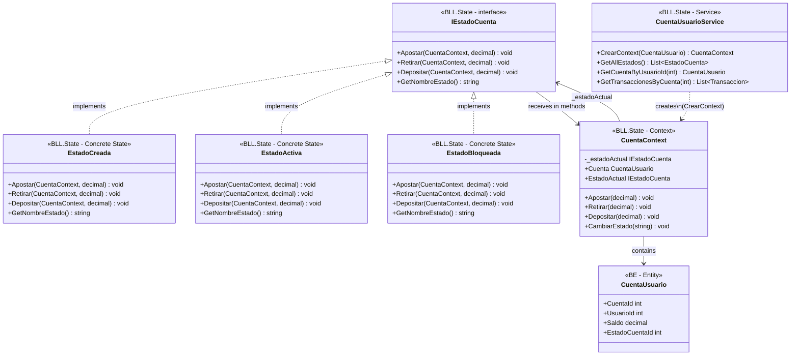

# Diagrama de Clases - Patrón State (Solo Patrón)

## Diagrama Mermaid

## Componentes del Patrón State

1. **IEstadoCuenta** (State Interface): Define el contrato común para todos los estados
2. **EstadoCreada, EstadoActiva, EstadoBloqueada** (Concrete States): Implementaciones concretas de cada estado
3. **CuentaContext** (Context): Mantiene referencia al estado actual (`_estadoActual`) y contiene la entidad `CuentaUsuario`. Delega operaciones al estado actual.
4. **CuentaUsuario** (Entity): Entidad de negocio que representa la cuenta en la base de datos
5. **CuentaUsuarioService** (Service): Factory para crear el `CuentaContext` y obtener datos desde repositorios. Actúa como intermediario entre UI y DAL respetando las 4 capas.

## Flujo de Ejecución

1. UI llama a `CuentaUsuarioService.GetCuentaByUsuarioId()` → BLL obtiene desde DAL
2. UI llama a `CuentaUsuarioService.CrearContext(cuenta)` → BLL crea el contexto con repositorios
3. `CuentaContext` inicializa el estado actual según `EstadoCuentaId` de la cuenta
4. UI llama directamente a métodos del `CuentaContext` (Apostar/Retirar/Depositar)
5. `CuentaContext` delega la operación al estado actual (`_estadoActual`)
6. El estado concreto valida y ejecuta la acción según sus reglas
7. El estado puede cambiar a otro estado llamando a `context.CambiarEstado()`

## Arquitectura de Capas

- **UI**: Solo ve `CuentaUsuarioService` (BLL)
- **BLL**: `CuentaUsuarioService` ve repositorios (DAL) y crea `CuentaContext`
- **DAL**: Repositorios acceden a la base de datos
- **BE**: Entidades de negocio

## Leyenda

- **<|..** : Implementación (implements)
- **-->** : Asociación/Uso
- **..>** : Dependencia/Creación
- **<<interface>>** : Indica una interfaz
- **<<Concrete State>>** : Estado concreto
- **<<Context>>** : Contexto del patrón State (mantiene el estado actual)
- **<<Entity>>** : Entidad de negocio
- **<<Service>>** : Servicio de la capa BLL (intermediario UI-DAL)
