# Diagrama de Clases - Patrón State (Completo)

## Diagrama Mermaid

```mermaid
classDiagram
    %% ============================================
    %% PATRÓN STATE
    %% ============================================
    
    class IEstadoCuenta {
        <<BLL.State - interface>>
        +Apostar(CuentaContext, decimal) void
        +Retirar(CuentaContext, decimal) void
        +Depositar(CuentaContext, decimal) void
        +GetNombreEstado() string
    }
    
    class EstadoCreada {
        <<BLL.State - Concrete State>>
        +Apostar(CuentaContext, decimal) void
        +Retirar(CuentaContext, decimal) void
        +Depositar(CuentaContext, decimal) void
        +GetNombreEstado() string
    }
    
    class EstadoActiva {
        <<BLL.State - Concrete State>>
        +Apostar(CuentaContext, decimal) void
        +Retirar(CuentaContext, decimal) void
        +Depositar(CuentaContext, decimal) void
        +GetNombreEstado() string
    }
    
    class EstadoBloqueada {
        <<BLL.State - Concrete State>>
        +Apostar(CuentaContext, decimal) void
        +Retirar(CuentaContext, decimal) void
        +Depositar(CuentaContext, decimal) void
        +GetNombreEstado() string
    }
    
    class CuentaContext {
        <<BLL.State - Context>>
        -_estadoActual IEstadoCuenta
        +Cuenta CuentaUsuario
        +EstadoActual IEstadoCuenta
        +_cuentaRepo ICuentaUsuarioRepository
        +_transaccionRepo ITransaccionRepository
        +_apuestaRepo ITransaccionApuestaRepository
        +_retiroRepo ITransaccionRetiroRepository
        +_depositoRepo ITransaccionDepositoRepository
        +_tipoRepo ITipoTransaccionRepository
        +Apostar(decimal) void
        +Retirar(decimal) void
        +Depositar(decimal) void
        +CambiarEstado(string) void
    }
    
    class CuentaUsuario {
        <<BE - Entity>>
        +CuentaId int
        +UsuarioId int
        +Saldo decimal
        +EstadoCuentaId int
        +FechaCreacion DateTime
        +FechaUltimaModificacion DateTime?
    }
    
    class CuentaUsuarioService {
        <<BLL.State - Service>>
        +CrearContext(CuentaUsuario) CuentaContext
        +GetAllEstados() List~EstadoCuenta~
        +GetCuentaByUsuarioId(int) CuentaUsuario
        +GetTransaccionesByCuenta(int) List~Transaccion~
    }
    
    class UsuarioService {
        <<BLL.Services>>
        +GetAll() List~Usuario~
        +GetById(int) Usuario
    }
    
    %% ============================================
    %% ENTIDADES DE NEGOCIO
    %% ============================================
    
    class Usuario {
        <<BE>>
        +UsuarioId int
        +Nombre string
        +Apellido string
        +Email string
        +Telefono string?
        +FechaRegistro DateTime
        +Activo bool
        +NombreCompleto string
    }
    
    class EstadoCuenta {
        <<BE>>
        +EstadoCuentaId int
        +CodigoEstado string
        +Descripcion string
    }
    
    class Transaccion {
        <<BE>>
        +TransaccionId int
        +CuentaId int
        +TipoTransaccionId int
        +Monto decimal
        +FechaTransaccion DateTime
        +Descripcion string
        +Exitoso bool
    }
    
    class TransaccionApuesta {
        <<BE>>
        +TransaccionApuestaId int
        +TransaccionId int
        +EventoDeportivo string
        +EquipoApostado string
        +Cuota decimal
        +MontoApostado decimal
    }
    
    class TransaccionRetiro {
        <<BE>>
        +TransaccionRetiroId int
        +TransaccionId int
        +MetodoRetiro string
        +NumeroCuentaDestino string
        +BancoDestino string
    }
    
    class TransaccionDeposito {
        <<BE>>
        +TransaccionDepositoId int
        +TransaccionId int
        +MetodoDeposito string
        +NumeroCuentaOrigen string
        +BancoOrigen string
    }
    
    class TipoTransaccion {
        <<BE>>
        +TipoTransaccionId int
        +CodigoTipo string
        +Descripcion string
    }
    
    %% ============================================
    %% DAL - REPOSITORIOS
    %% ============================================
    
    class ICuentaUsuarioRepository {
        <<DAL.Abstraccion - interface>>
        +GetById(int) CuentaUsuario
        +GetByUsuarioId(int) CuentaUsuario
        +GetSaldo(int) decimal
        +UpdateSaldo(int, decimal) bool
        +UpdateEstado(int, int) bool
    }
    
    class IEstadoCuentaRepository {
        <<DAL.Abstraccion - interface>>
        +GetAll() List~EstadoCuenta~
        +GetById(int) EstadoCuenta
        +GetByCodigo(string) EstadoCuenta
    }
    
    class ITransaccionRepository {
        <<DAL.Abstraccion - interface>>
        +GetAll() List~Transaccion~
        +GetByCuentaId(int) List~Transaccion~
        +Insert(Transaccion) int
    }
    
    class ITransaccionApuestaRepository {
        <<DAL.Abstraccion - interface>>
        +GetByTransaccionId(int) TransaccionApuesta
        +Insert(TransaccionApuesta) int
    }
    
    class ITransaccionRetiroRepository {
        <<DAL.Abstraccion - interface>>
        +GetByTransaccionId(int) TransaccionRetiro
        +Insert(TransaccionRetiro) int
    }
    
    class ITransaccionDepositoRepository {
        <<DAL.Abstraccion - interface>>
        +GetByTransaccionId(int) TransaccionDeposito
        +Insert(TransaccionDeposito) int
    }
    
    class ITipoTransaccionRepository {
        <<DAL.Abstraccion - interface>>
        +GetByCodigo(string) TipoTransaccion
    }
    
    class IUsuarioRepository {
        <<DAL.Abstraccion - interface>>
        +GetAll() List~Usuario~
        +GetById(int) Usuario
    }
    
    %% ============================================
    %% RELACIONES - PATRÓN STATE
    %% ============================================
    
    %% Herencia: Estados concretos implementan IEstadoCuenta
    IEstadoCuenta <|.. EstadoCreada : implements
    IEstadoCuenta <|.. EstadoActiva : implements
    IEstadoCuenta <|.. EstadoBloqueada : implements
    
    %% Context mantiene referencia al estado actual y contiene la entidad
    CuentaContext --> IEstadoCuenta : _estadoActual
    CuentaContext --> CuentaUsuario : contains
    
    %% Context usa Repositories (accesibles desde estados)
    CuentaContext --> ICuentaUsuarioRepository : uses
    CuentaContext --> ITransaccionRepository : uses
    CuentaContext --> ITransaccionApuestaRepository : uses
    CuentaContext --> ITransaccionRetiroRepository : uses
    CuentaContext --> ITransaccionDepositoRepository : uses
    CuentaContext --> ITipoTransaccionRepository : uses
    CuentaContext --> IEstadoCuentaRepository : uses
    
    %% Service crea el Context (Factory) y obtiene datos
    CuentaUsuarioService ..> CuentaContext : creates\n(CrearContext)
    CuentaUsuarioService --> ICuentaUsuarioRepository : uses\n(GetCuentaByUsuarioId)
    CuentaUsuarioService --> IEstadoCuentaRepository : uses\n(GetAllEstados)
    CuentaUsuarioService --> ITransaccionRepository : uses\n(GetTransaccionesByCuenta)
    
    %% Estados reciben el Context en sus métodos
    IEstadoCuenta --> CuentaContext : receives in methods
    
    %% Service relationships
    UsuarioService --> IUsuarioRepository : uses
    
    %% Entities relationships
    CuentaUsuario --> EstadoCuenta : references\n(EstadoCuentaId)
    CuentaUsuario --> Usuario : references\n(UsuarioId)
    TransaccionApuesta --> Transaccion : references
    TransaccionRetiro --> Transaccion : references
    TransaccionDeposito --> Transaccion : references
    Transaccion --> CuentaUsuario : references
    Transaccion --> TipoTransaccion : references
```

## Componentes del Patrón State

1. **IEstadoCuenta** (State Interface): Define el contrato común para todos los estados
2. **EstadoCreada, EstadoActiva, EstadoBloqueada** (Concrete States): Implementaciones concretas de cada estado
3. **CuentaContext** (Context): Mantiene referencia al estado actual (`_estadoActual`) y contiene la entidad `CuentaUsuario`. Delega operaciones al estado actual y proporciona acceso a repositorios.
4. **CuentaUsuario** (Entity): Entidad de negocio que representa la cuenta en la base de datos
5. **CuentaUsuarioService** (Service): Factory para crear el `CuentaContext` y obtener datos desde repositorios. Actúa como intermediario entre UI y DAL, respetando la arquitectura de 4 capas.

## Flujo de Ejecución

1. UI llama a `CuentaUsuarioService.GetCuentaByUsuarioId()` → BLL obtiene desde DAL
2. UI llama a `CuentaUsuarioService.CrearContext(cuenta)` → BLL crea el contexto con todos los repositorios necesarios
3. `CuentaContext` inicializa el estado actual según `EstadoCuentaId` de la cuenta
4. UI llama directamente a métodos del `CuentaContext` (Apostar/Retirar/Depositar)
5. `CuentaContext` delega la operación al estado actual (`_estadoActual`)
6. El estado concreto recibe el `CuentaContext` y accede a:
   - `context.Cuenta` para obtener la entidad
   - `context._cuentaRepo`, `context._transaccionRepo`, etc. para persistir cambios
7. El estado valida y ejecuta la acción según sus reglas
8. El estado puede cambiar a otro estado llamando a `context.CambiarEstado()`

## Arquitectura de Capas

- **UI (FrmState)**: Solo ve `CuentaUsuarioService` (BLL) y trabaja con `CuentaContext`
- **BLL**: 
  - `CuentaUsuarioService` ve repositorios (DAL) y crea `CuentaContext`
  - `CuentaContext` implementa el patrón State
- **DAL**: Repositorios acceden a la base de datos
- **BE**: Entidades de negocio

## Responsabilidades

- **CuentaUsuarioService**: Factory y obtención de datos (intermediario UI-DAL)
- **CuentaContext**: Implementación del patrón State (delega a estados)
- **Estados**: Lógica de negocio específica por estado

## Leyenda

- **<|..** : Implementación (implements)
- **-->** : Asociación/Uso
- **..>** : Dependencia/Creación
- **<<interface>>** : Indica una interfaz
- **<<Concrete State>>** : Estado concreto
- **<<Context>>** : Contexto del patrón State (mantiene el estado actual y delega operaciones)
- **<<Entity>>** : Entidad de negocio
- **<<Service>>** : Servicio de la capa BLL (intermediario UI-DAL, respeta arquitectura de 4 capas)
