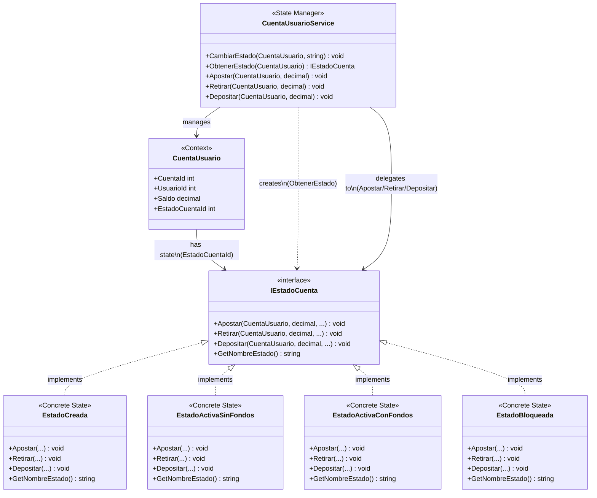

# Diagrama de Clases - Patrón State (Solo Patrón)

## Diagrama Mermaid

## Componentes del Patrón State

1. **IEstadoCuenta** (State Interface): Define el contrato común para todos los estados
2. **EstadoCreada, EstadoActivaSinFondos, EstadoActivaConFondos, EstadoBloqueada** (Concrete States): Implementaciones concretas de cada estado
3. **CuentaUsuario** (Context): Mantiene referencia al estado actual a través de `EstadoCuentaId`
4. **CuentaUsuarioService** (State Manager): Gestiona las transiciones de estado y delega acciones al estado actual

## Flujo de Ejecución

1. `CuentaUsuarioService` obtiene el estado actual de la cuenta mediante `ObtenerEstado()`
2. El servicio crea la instancia del estado concreto correspondiente
3. El servicio delega la acción (Apostar/Retirar/Depositar) al estado actual
4. El estado concreto valida y ejecuta la acción según sus reglas
5. El estado puede cambiar a otro estado según las reglas de negocio

## Leyenda

- **<|..** : Implementación (implements)
- **-->** : Asociación/Uso
- **..>** : Dependencia/Creación
- **<<interface>>** : Indica una interfaz
- **<<Concrete State>>** : Estado concreto
- **<<Context>>** : Contexto del patrón State
- **<<State Manager>>** : Gestor de estados

