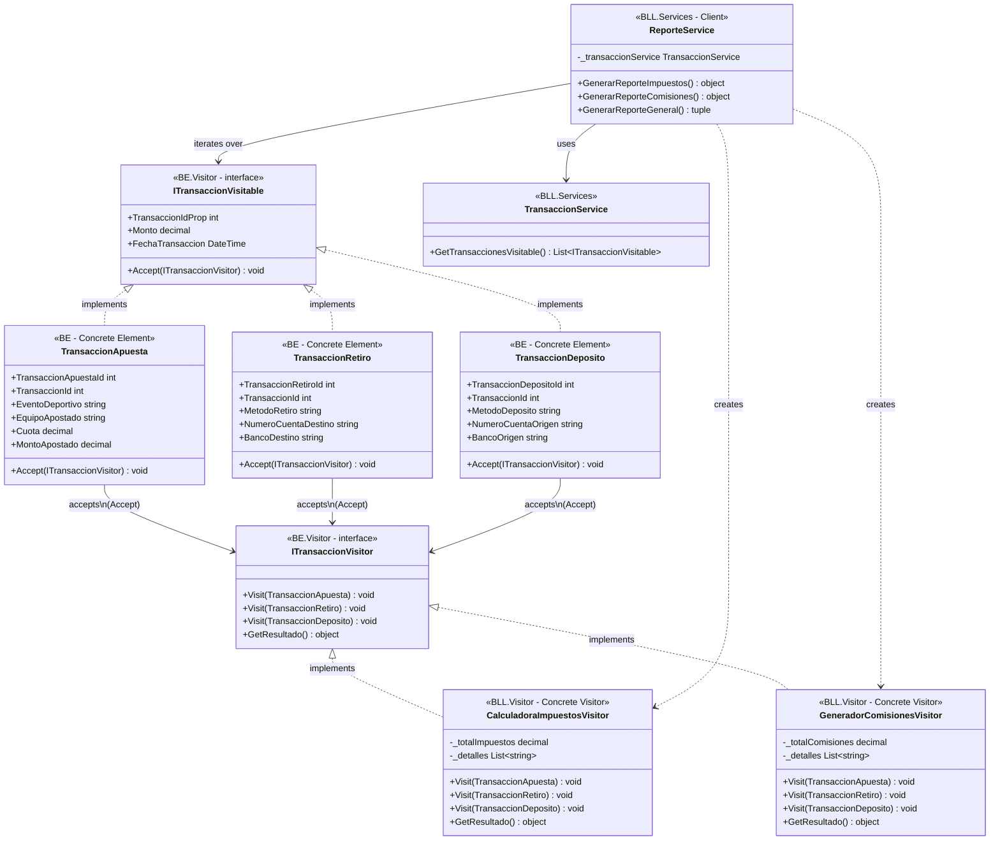

# Diagrama de Clases - Patrón Visitor (Solo Patrón)

## Diagrama Mermaid

## Componentes del Patrón Visitor

1. **ITransaccionVisitable** (Element Interface): Define el método `Accept()` que permite a los visitantes acceder al elemento
2. **TransaccionApuesta, TransaccionRetiro, TransaccionDeposito** (Concrete Elements): Implementan `ITransaccionVisitable` y definen `Accept()`
3. **ITransaccionVisitor** (Visitor Interface): Define métodos `Visit()` para cada tipo de elemento
4. **CalculadoraImpuestosVisitor, GeneradorComisionesVisitor** (Concrete Visitors): Implementan `ITransaccionVisitor` y contienen la lógica de cálculo
5. **ReporteService** (Client): Orquesta el patrón, crea visitantes y itera sobre elementos
6. **TransaccionService** (Service): Prepara los elementos visitables desde la base de datos

## Flujo de Ejecución

1. `ReporteService` llama a `TransaccionService.GetTransaccionesVisitable()` para obtener elementos
2. `TransaccionService` carga transacciones desde la BD y crea objetos visitables
3. `ReporteService` crea un visitor concreto (ej: `CalculadoraImpuestosVisitor`)
4. `ReporteService` itera sobre los elementos llamando `elemento.Accept(visitor)`
5. Cada elemento llama al método `Visit()` correspondiente del visitor
6. El visitor acumula cálculos en su estado interno
7. `ReporteService` obtiene el resultado con `visitor.GetResultado()`

## Leyenda

- **<|..** : Implementación (implements)
- **-->** : Asociación/Uso
- **..>** : Dependencia/Creación
- **<<interface>>** : Indica una interfaz
- **<<Concrete Element>>** : Elemento concreto
- **<<Concrete Visitor>>** : Visitante concreto
- **<<Client>>** : Cliente que usa el patrón

