# Diagrama de Clases - Patrón Visitor (Completo)

## Diagrama Mermaid

```mermaid
classDiagram
    %% ============================================
    %% PATRÓN VISITOR
    %% ============================================
    
    class ITransaccionVisitable {
        <<BE.Visitor - interface>>
        +Accept(ITransaccionVisitor) void
        +TransaccionIdProp int
        +Monto decimal
        +FechaTransaccion DateTime
    }
    
    class ITransaccionVisitor {
        <<BE.Visitor - interface>>
        +Visit(TransaccionApuesta) void
        +Visit(TransaccionRetiro) void
        +Visit(TransaccionDeposito) void
        +GetResultado() object
    }
    
    class TransaccionApuesta {
        <<BE - Concrete Element>>
        +TransaccionApuestaId int
        +TransaccionId int
        +EventoDeportivo string
        +EquipoApostado string
        +Cuota decimal
        +MontoApostado decimal
        +Transaccion Transaccion
        +Accept(ITransaccionVisitor) void
    }
    
    class TransaccionRetiro {
        <<BE - Concrete Element>>
        +TransaccionRetiroId int
        +TransaccionId int
        +MetodoRetiro string
        +NumeroCuentaDestino string
        +BancoDestino string
        +Transaccion Transaccion
        +Accept(ITransaccionVisitor) void
    }
    
    class TransaccionDeposito {
        <<BE - Concrete Element>>
        +TransaccionDepositoId int
        +TransaccionId int
        +MetodoDeposito string
        +NumeroCuentaOrigen string
        +BancoOrigen string
        +Transaccion Transaccion
        +Accept(ITransaccionVisitor) void
    }
    
    class CalculadoraImpuestosVisitor {
        <<BLL.Visitor - Concrete Visitor>>
        -_totalImpuestos decimal
        -_detalles List~string~
        +Visit(TransaccionApuesta) void
        +Visit(TransaccionRetiro) void
        +Visit(TransaccionDeposito) void
        +GetResultado() object
    }
    
    class GeneradorComisionesVisitor {
        <<BLL.Visitor - Concrete Visitor>>
        -_totalComisiones decimal
        -_detalles List~string~
        +Visit(TransaccionApuesta) void
        +Visit(TransaccionRetiro) void
        +Visit(TransaccionDeposito) void
        +GetResultado() object
    }
    
    class ReporteService {
        <<BLL.Services - Client>>
        -_transaccionService TransaccionService
        +GenerarReporteImpuestos() object
        +GenerarReporteComisiones() object
        +GenerarReporteGeneral() tuple
    }
    
    class TransaccionService {
        <<BLL.Services>>
        -_transaccionRepo ITransaccionRepository
        -_apuestaRepo ITransaccionApuestaRepository
        -_retiroRepo ITransaccionRetiroRepository
        -_depositoRepo ITransaccionDepositoRepository
        +GetTransaccionesByCuenta(int) List~Transaccion~
        +GetTransaccionesVisitable() List~ITransaccionVisitable~
    }
    
    %% ============================================
    %% ENTIDADES DE NEGOCIO
    %% ============================================
    
    class Transaccion {
        <<BE>>
        +TransaccionId int
        +CuentaId int
        +TipoTransaccionId int
        +Monto decimal
        +FechaTransaccion DateTime
        +Descripcion string
        +Exitoso bool
    }
    
    class CuentaUsuario {
        <<BE>>
        +CuentaId int
        +UsuarioId int
        +Saldo decimal
        +EstadoCuentaId int
    }
    
    %% ============================================
    %% DAL - REPOSITORIOS
    %% ============================================
    
    class ITransaccionRepository {
        <<DAL - interface>>
        +GetAll() List~Transaccion~
        +GetByCuentaId(int) List~Transaccion~
        +GetById(int) Transaccion
    }
    
    class ITransaccionApuestaRepository {
        <<DAL - interface>>
        +GetAll() List~TransaccionApuesta~
        +GetByTransaccionId(int) TransaccionApuesta
    }
    
    class ITransaccionRetiroRepository {
        <<DAL - interface>>
        +GetAll() List~TransaccionRetiro~
        +GetByTransaccionId(int) TransaccionRetiro
    }
    
    class ITransaccionDepositoRepository {
        <<DAL - interface>>
        +GetAll() List~TransaccionDeposito~
        +GetByTransaccionId(int) TransaccionDeposito
    }
    
    %% ============================================
    %% RELACIONES - PATRÓN VISITOR
    %% ============================================
    
    %% Elements implementan ITransaccionVisitable
    ITransaccionVisitable <|.. TransaccionApuesta : implements
    ITransaccionVisitable <|.. TransaccionRetiro : implements
    ITransaccionVisitable <|.. TransaccionDeposito : implements
    
    %% Visitors implementan ITransaccionVisitor
    ITransaccionVisitor <|.. CalculadoraImpuestosVisitor : implements
    ITransaccionVisitor <|.. GeneradorComisionesVisitor : implements
    
    %% Elements aceptan Visitors
    TransaccionApuesta --> ITransaccionVisitor : accepts\n(Accept)
    TransaccionRetiro --> ITransaccionVisitor : accepts\n(Accept)
    TransaccionDeposito --> ITransaccionVisitor : accepts\n(Accept)
    
    %% Client usa Service y Visitors
    ReporteService --> TransaccionService : uses
    ReporteService ..> CalculadoraImpuestosVisitor : creates
    ReporteService ..> GeneradorComisionesVisitor : creates
    ReporteService --> ITransaccionVisitable : iterates over
    
    %% Service usa Repositories
    TransaccionService --> ITransaccionRepository : uses
    TransaccionService --> ITransaccionApuestaRepository : uses
    TransaccionService --> ITransaccionRetiroRepository : uses
    TransaccionService --> ITransaccionDepositoRepository : uses
    
    %% Entities relationships
    TransaccionApuesta --> Transaccion : references
    TransaccionRetiro --> Transaccion : references
    TransaccionDeposito --> Transaccion : references
    Transaccion --> CuentaUsuario : references
```

## Componentes del Patrón Visitor

1. **ITransaccionVisitable** (Element Interface - BE.Visitor): Define el método `Accept()` que permite a los visitantes acceder al elemento
2. **TransaccionApuesta, TransaccionRetiro, TransaccionDeposito** (Concrete Elements - BE): Implementan `ITransaccionVisitable` y definen `Accept()`
3. **ITransaccionVisitor** (Visitor Interface - BE.Visitor): Define métodos `Visit()` para cada tipo de elemento
4. **CalculadoraImpuestosVisitor, GeneradorComisionesVisitor** (Concrete Visitors - BLL.Visitor): Implementan `ITransaccionVisitor` y contienen la lógica de cálculo
5. **ReporteService** (Client - BLL.Services): Orquesta el patrón, crea visitantes y itera sobre elementos
6. **TransaccionService** (Service - BLL.Services): Prepara los elementos visitables desde la base de datos

## Flujo de Ejecución

1. `ReporteService` llama a `TransaccionService.GetTransaccionesVisitable()`
2. `TransaccionService` carga todas las transacciones desde `ITransaccionRepository.GetAll()`
3. Para cada transacción, `TransaccionService` busca el tipo específico usando los repositorios correspondientes
4. `TransaccionService` crea objetos `TransaccionApuesta`, `TransaccionRetiro`, o `TransaccionDeposito` que implementan `ITransaccionVisitable`
5. `ReporteService` crea un visitor concreto (ej: `CalculadoraImpuestosVisitor`)
6. `ReporteService` itera sobre los elementos llamando `elemento.Accept(visitor)`
7. Cada elemento llama al método `Visit()` correspondiente del visitor (double dispatch)
8. El visitor acumula cálculos en su estado interno
9. `ReporteService` obtiene el resultado con `visitor.GetResultado()`

## Leyenda

- **<|..** : Implementación (implements)
- **-->** : Asociación/Uso
- **..>** : Dependencia/Creación
- **<<interface>>** : Indica una interfaz
- **<<Concrete Element>>** : Elemento concreto
- **<<Concrete Visitor>>** : Visitante concreto
- **<<Client>>** : Cliente que usa el patrón

## Ventajas del Patrón Visitor

- **Extensibilidad**: Se pueden agregar nuevos visitantes sin modificar las clases de elementos
- **Separación de responsabilidades**: La lógica de cálculo está en los visitantes, no en los elementos
- **Double Dispatch**: Permite ejecutar operaciones específicas según el tipo de elemento y visitante

